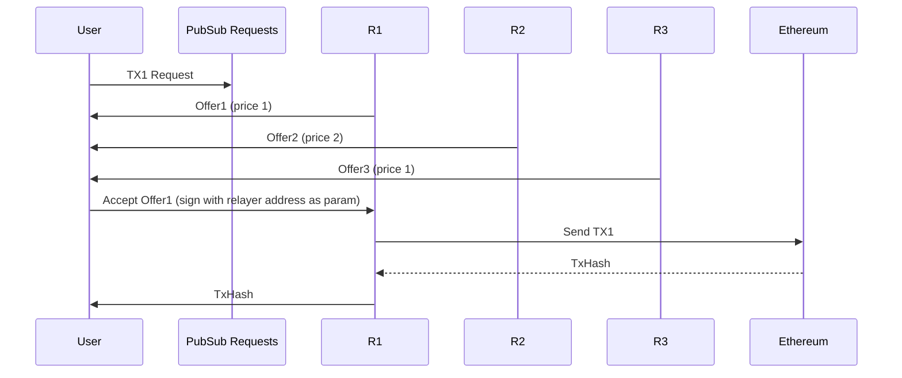

# CL-R-Network (ChronoLogic Relayers Network)

### Note: Please use VSCode with https://marketplace.visualstudio.com/items?itemName=searKing.preview-vscode extension to render Mermaid graphs.

## Bidding scheme

User sends request for execution, relayers send theirs offers, user picks the cheapest one and signs the allowance for the cheapest relayer.

**Architecture**: unstructured p2p network with pub/sub for request publishing (pubsub using libp2p), and p2p (user<>relayer) channel for negotiation

Known issues / attacks:
* Relayer does not execute after being picked
  * Potential solution: Wait for tx hash for some time and repeat the query - exclude the previous relayer (temporary blacklist)
* Timeouts assumptions?: Protocol depends on timeouts, 1) waiting for offers and then act 2) waiting for execution and then take another round
* Requires user to stay online until transaction included - potentially few rounds until get executed.

Notes:

* Multi-token scenario: User could include the list of tokens we may want to pay with, relayers accepting given token will respond with amount, other will ignore 

## Delayed Bidding scheme

The purpose is enable scheduled (delayed) execution using p2p network. 

Due to delayed execution there is a need for the storage for those delayed tx, previous scheme assumed that User is online during the process which cannot be used in current scheme.

External storage might be necessary to hold the TX until it's valid (addressing scheme for ordering messages)

## Delayed Conditional Bidding scheme

Similar to Delayed Bidding but the moment of execution is unknown (non-deterministic) and is based on conditions becoming `true` (EVM lambdas...) which requires the constant watching for conditions (polling the `canExecute` function...).

Payment: 
* Relayer can asses the gas usage using estimateGas
* Relayers should return the amount of tokens/eth per period of time (rent) - rationale: relayer has to stay online and watch the state and act